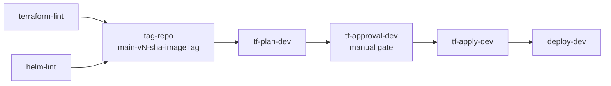
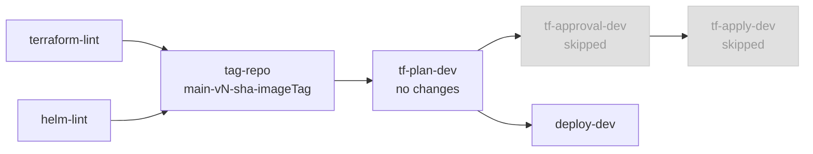
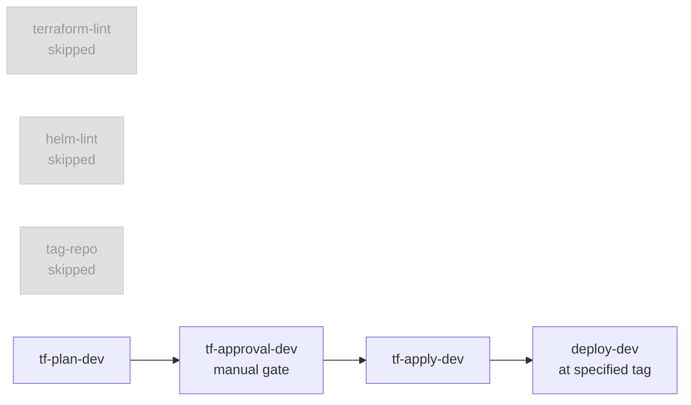
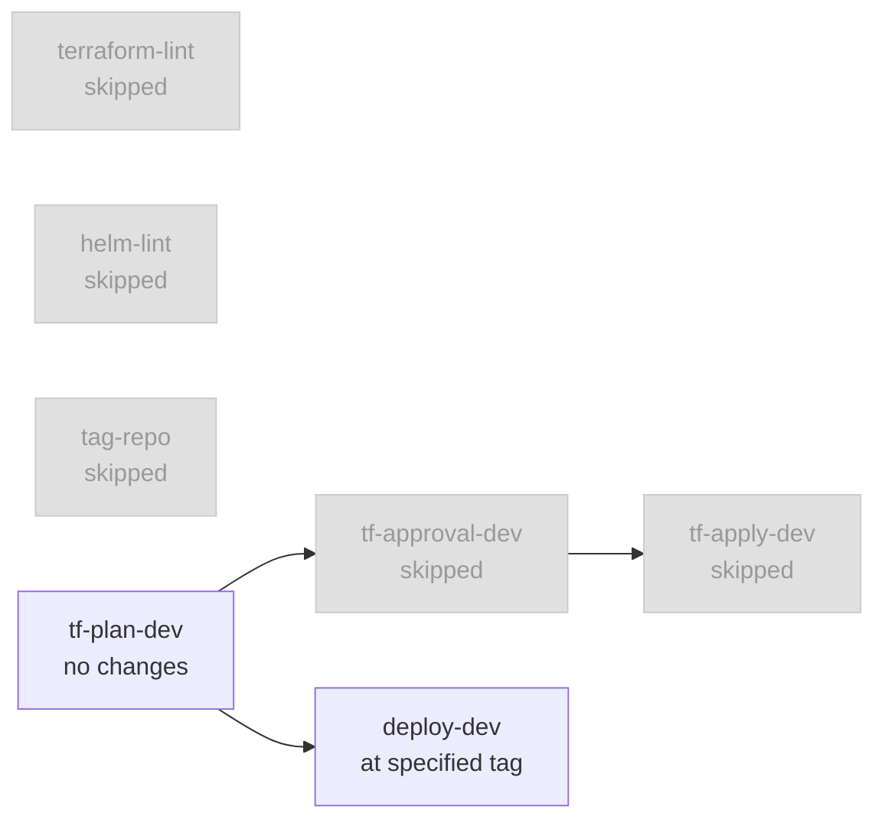

# otp2int-deployment-config

Helm deployment configuration for the **otp2int** (OpenTripPlanner International) instance at Entur.

## Overview

`otp2int` is a separate OTP2 instance covering Norway Sweden, Denmark, and Finland . It runs alongside the Norwegian `otp2` instance in the same Kubernetes cluster but as an independent deployment with its own graph data, buckets, and GCP project.

## Structure

```
helm/otp2int/
├── Chart.yaml
├── values.yaml                        # Default values
├── env/
│   ├── logback.xml
│   └── values-kub-ent-jp-dev.yaml     # Dev environment overrides
└── templates/
    ├── deployment.yaml                # OTP2int journey planner
    ├── service.yaml
    ├── ingress.yaml
    ├── configmap.yaml                 # router-config.json
    ├── otp2-feature-configmap.yaml    # otp-config.json feature flags
    ├── logback-configmap.yaml
    ├── secrets.yaml                   # ExternalSecrets (SLACK_URL, SAMTRAFIKEN_API_KEY)
    ├── rbac.yaml
    ├── horizontaloidautoscaler.yaml
    ├── configmap-graph-builder.yaml   # Graph builder build/otp config
    ├── cronjob-graph-builder.yaml     # Graph builder job template (suspend=true)
    ├── logback-configmap-graph-builder.yaml
    └── cronjob-redeploy-otp2.yaml     # Watches GCS pointer, rolls deployment
```

## Components

### Journey Planner
Serves the OTP2 GraphQL/REST API. Loads graphs from GCS on startup by watching the `current-otp2int` pointer file in the graph bucket.

### Graph Builder
A suspended CronJob used as a job template — triggered manually. Builds graphs from:
- **Sweden** — NeTEx 
- **Norway** — NeTEx 
OSM data is pulled from Geofabrik for Norway and Sweden. No elevation data or real-time updates.

#### Adding new sources
1. Update `helm/otp2int/templates/configmap-graph-builder.yaml`
   1. `transitFeeds`, see the other sources for examples
   2. `osm`, see the other sources for examples
2. Ensure otp2int pipeline has access to the new sources

## CI/CD Workflows

### Normal Deploy (push to main / workflow_dispatch without tag)

#### With Terraform changes



#### Without Terraform changes



> `tf-approval-dev` and `tf-apply-dev` are skipped when `tf-plan` detects no changes. `deploy-dev` runs regardless since skipped ≠ failure.

### Rollback (workflow_dispatch with tag input)

#### With Terraform changes



#### Without Terraform changes



> `terraform-lint`, `helm-lint` and `tag-repo` are always skipped on rollback. Terraform plan/apply only runs if there are infra changes to roll back. Helm always deploys the config and image from the specified tag.

### Deploying / Rolling Back

| Action | How |
|---|---|
| Normal deploy | Push to `main` or trigger workflow without tag |
| Roll back | Trigger workflow → enter tag e.g. `main-v19-ccde0368-v2.10.0-entur-32` |
| Find available tags | `git tag -l` or GitHub → Code → Tags |

